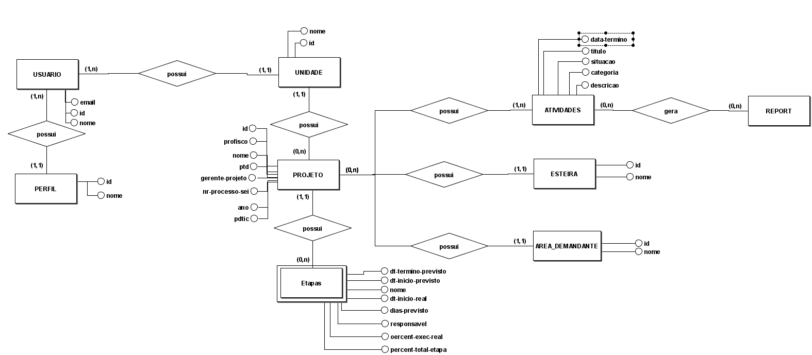

# Modelagem do banco de dados

A seguir temos o modelo conceitual, lógico e físico do projeto, datado em: 28/10/2025


## Modelo Conceitual



## Modelo Lógico


### DDL


```sql

DROP TABLE IF EXISTS atividades;
DROP TABLE IF EXISTS etapa;
DROP TABLE IF EXISTS projeto;
DROP TABLE IF EXISTS usuario;
DROP TABLE IF EXISTS area_demandante;
DROP TABLE IF EXISTS esteira;
DROP TABLE IF EXISTS unidade;
DROP TABLE IF EXISTS perfil;


CREATE TABLE perfil (
    id VARCHAR(100) PRIMARY KEY, 
    nome TEXT NOT NULL
);

CREATE TABLE unidade (
    id INTEGER GENERATED BY DEFAULT AS IDENTITY PRIMARY KEY,
    nome TEXT NOT NULL
);

CREATE TABLE esteira (
    id INTEGER GENERATED BY DEFAULT AS IDENTITY PRIMARY KEY,
    nome TEXT NOT NULL
);

CREATE TABLE area_demandante (
    id INTEGER GENERATED BY DEFAULT AS IDENTITY PRIMARY KEY,
    nome TEXT NOT NULL
);


CREATE TABLE usuario (
    id INTEGER GENERATED BY DEFAULT AS IDENTITY PRIMARY KEY,
    email TEXT NOT NULL UNIQUE,
    nome TEXT NOT NULL,
    
    perfil VARCHAR(100),
    unidade INTEGER,

    CONSTRAINT fk_usuario_perfil
        FOREIGN KEY (perfil) REFERENCES perfil(id)
        ON DELETE NO ACTION ON UPDATE CASCADE,
    
    CONSTRAINT fk_usuario_unidade
        FOREIGN KEY (unidade) REFERENCES unidade(id)
        ON DELETE NO ACTION ON UPDATE CASCADE
);

CREATE TABLE projeto (
    id INTEGER GENERATED BY DEFAULT AS IDENTITY PRIMARY KEY,
    nome TEXT NOT NULL,
    gerente TEXT,
    nr_processo_sei VARCHAR(255),
    ano VARCHAR(4),
    profisco BOOLEAN NOT NULL DEFAULT FALSE,
    ptd BOOLEAN NOT NULL DEFAULT FALSE,
    utd BOOLEAN NOT NULL DEFAULT FALSE,
    
    unidade INTEGER,

    CONSTRAINT fk_projeto_unidade
        FOREIGN KEY (unidade) REFERENCES unidade(id)
        ON DELETE NO ACTION ON UPDATE CASCADE
);

CREATE TABLE etapa (
    id INTEGER GENERATED BY DEFAULT AS IDENTITY PRIMARY KEY,
    nome TEXT NOT NULL,
    dt_termino_previsto DATE,
    dt_inicio_previsto DATE,
    dt_inicio_real DATE,
    responsavel TEXT,
    percent_exec_real DECIMAL(5, 2) NOT NULL DEFAULT 0.0,
    percent_total_etapa DECIMAL(5, 2) NOT NULL DEFAULT 0.0,
    
    projeto INTEGER,
    esteira INTEGER,
    area_demandante INTEGER,

    CONSTRAINT fk_etapa_projeto
        FOREIGN KEY (projeto) REFERENCES projeto(id)
        ON DELETE NO ACTION ON UPDATE CASCADE,
    
    CONSTRAINT fk_etapa_esteira
        FOREIGN KEY (esteira) REFERENCES esteira(id)
        ON DELETE NO ACTION ON UPDATE CASCADE,
    
    CONSTRAINT fk_etapa_area_demandante
        FOREIGN KEY (area_demandante) REFERENCES area_demandante(id)
        ON DELETE NO ACTION ON UPDATE CASCADE
);

CREATE TABLE atividades (
    id INTEGER GENERATED BY DEFAULT AS IDENTITY PRIMARY KEY,
    titulo TEXT NOT NULL,
    situacao VARCHAR(100) DEFAULT 'A Fazer',
    categoria VARCHAR(100),
    descricao TEXT,
    
    projeto INTEGER,

    CONSTRAINT fk_atividades_projeto
        FOREIGN KEY (projeto) REFERENCES projeto(id)
        ON DELETE NO ACTION ON UPDATE CASCADE
);

```


